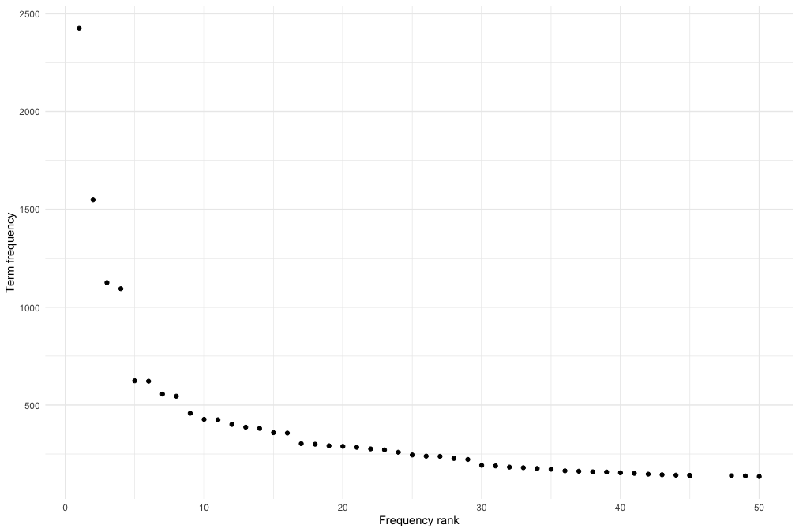
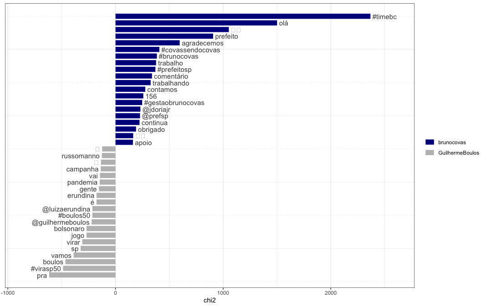

# Quanteda and Twitter 2

Rodrigo Esteves de Lima Lopes \
*Campinas State University* \
[rll307@unicamp.br](mailto:rll307@unicamp.br)


# Introduction

[Quanteda](https://quanteda.io/) is a package for managing and analyse text quantitatively. It is quite easy to use and will bring us a number of interesting functions. 

## You will need:

1. The package [`Quanteda`](https://quanteda.io/), which can be installed using [RStudio](http://www.sthda.com/english/wiki/installing-and-using-r-packages)
1. The package `rtweet`, we installed [last tutorial](https://github.com/MiDiTeS/intro_to_R1/blob/master/Module_3/04_rtweet.md). 
1. Package `DT` for viewing the KWIC inside R. 
1. `Ggplot` for viewing some graphics

## Data

We are going to use the same data we have used in the previous tutorials

# Making some comparissions

First we need to save our texts as vectors 


```r
boulos.v <- boulos$text
covas.v <- covas$text
```

Kwic in the terminal


```r
kwic(boulos.v,"prefeitura")
```

Kwic in the Viewer (it views but does not save)


```r
kwic(covas.v,"prefeitura")%>%View()
```

Now, saving as a variable

```r
prefeitura.b <- kwic(boulos.v,"prefeitura")
```

This command can also be applied to a corpus:


```r
kwic(boulos.corpus,"prefeitura")%>%View()
```

Now lets keep on our analysis. We can use the same DFMs we created before, but I will create a couple just to apply some new commands

First step now is to make all lower caps:


```r
boulos.lower.v <- char_tolower(boulos.v)
covas.lower.v <- char_tolower(covas.v)
```

Now, we create a lower character vector


```r
boulos.word.v <- tokens(boulos.lower.v, 
                        remove_punct = TRUE) %>% as.character()
covas.word.v <- tokens(covas.lower.v, 
                       remove_punct = TRUE) %>% as.character()
```

So now, we have our second DFM:


```r
boulos.dfm.2 <- dfm(boulos.lower.v,
                    remove_punct = TRUE,
                    remove = stopwords("portuguese"))


covas.dfm.2 <- dfm(covas.lower.v,
                    remove_punct = TRUE,
                    remove = stopwords("portuguese"))
```

Now we are creating our word list


```r
boulos.wl<-textstat_frequency(boulos.dfm.2) 
View(boulos.wl)

covas.wl<-textstat_frequency(covas.dfm.2) 
View(covas.wl)
```

Lets us plot a single candidate at a time:


```r
library(ggplot2)
theme_set(theme_minimal())
textstat_frequency(covas.dfm.2, n = 50) %>% 
  ggplot(aes(x = rank, y = frequency)) +
  geom_point() +
  labs(x = "Frequency rank", y = "Term frequency")
```


```r
theme_set(theme_minimal())
textstat_frequency(boulos.dfm.2, n = 50) %>% 
  ggplot(aes(x = rank, y = frequency)) +
  geom_point() +
  labs(x = "Frequency rank", y = "Term frequency")
```

The results are:




Quanteda makes key wordlists. Keywords are a comparison between two groups of texts. One is the reference and tells me the statistical baseline for comparison, the other is my research text (or texts). Here, for the sake of the exercise, we will compare Boulos and Covas. 


```r
all.dfm3 <- dfm(all.corpora, groups = "screen_name", remove = stopwords("portuguese"), 
                remove_punct = TRUE)

keyness <- textstat_keyness(all.dfm3, target = "brunocovas")
textplot_keyness(keyness)
```

The result is something like



# Some collocates

The command `textstat_collocations` calculates n-grams based on a corpus previously created. Unfortunately, for the time being the only calculation possible is `lambda`. 


```r
tri.grams<-textstat_collocations(
  boulos.corpus,
  method = "lambda",
  size = 3,
  min_count = 5,
  smoothing = 0.5,
  tolower = TRUE)
```

The result is something similar to:


```r
head(tri.grams)
```

```
##       collocation count count_nested length    lambda        z
## 1     não para de     8            0      3 11.117795 5.407809
## 2    para mais ou    14            0      3  7.132262 4.938017
## 3  apoio a boulos    12            0      3  5.054780 4.731241
## 4 maior cidade do    28            0      3  5.089345 4.534803
## 5        esse é o    30            0      3  3.613462 4.501427
## 6        essa é a    16            0      3  3.445065 4.434219
```


