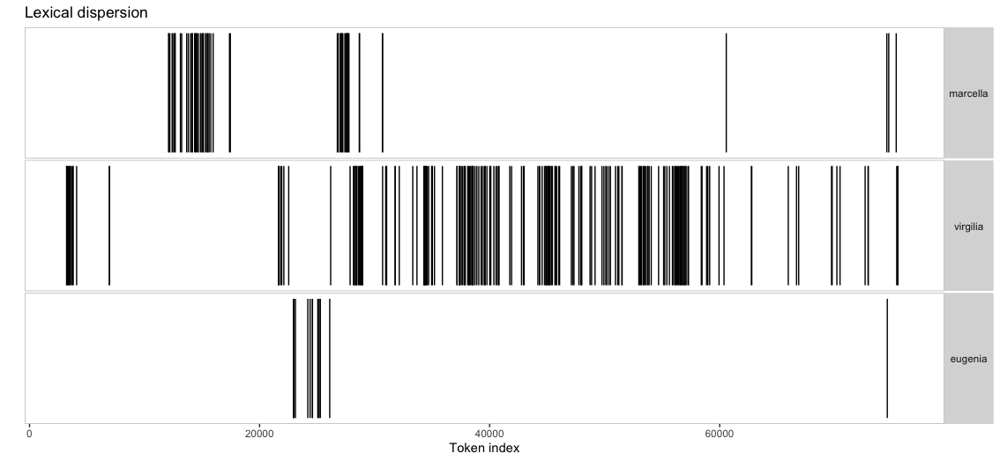
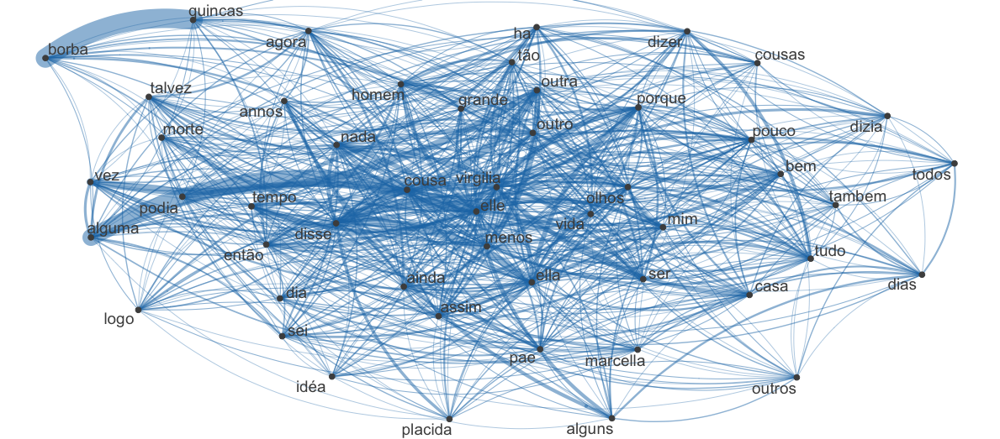

# Quanteda and Dom Casmurro

Rodrigo Esteves de Lima Lopes \
*Campinas State University* \
[rll307@unicamp.br](mailto:rll307@unicamp.br)


# Introduction

In this tutorial we are going to keep on using some of [Quanteda's ](https://quanteda.io/) functionalities and apply it to two sets of data: the first is a book by Machado de Assis and, second, a group of tweets you will scrape and show to the class. 

## What we need

I this tutorial we will need the following packages, all previously used:

```r
library(gutenbergr)
library(quanteda)
library(dplyr)
library(ggplot2)
```

# Machado's book

First we will scrap the book from Gutenberg Project and correct the character encoding


```r
M.0  <- gutenberg_download(54829)
MP <- M.0 %>% 
  mutate(text=iconv(text, from = "latin1", to = "UTF-8"))
```

Now lets extract the text and change characters to lower case

```r
MP <- MP$text
MP <- paste(MP, collapse=" ")
MP.l<-char_tolower(MP)
```

Now we are going to make a character vector of the tokens present in the book


```r
MP_v <- tokens(MP.l, remove_punct = TRUE) %>% 
  as.character()
total_length <- length(MP_v)
```

Now let us observe the number of types and tokens available


```r
# Total of tokens
ntoken(char_tolower(MP), remove_punct = TRUE)

# Total of types
ntype(char_tolower(MP), remove_punct = TRUE)
```

Now let us find out Ten most frequent words and save the results in a Data Frame


```r
MP.dfm <- dfm(MP.l, remove_punct = TRUE)
View (MP.dfm)
textstat_frequency(MP.dfm, n = 10)
MP.WL <- textstat_frequency(MP.dfm)
```

Comparing Casmurro's passions


```r
textplot_xray(
  kwic(MP.l, pattern = "marcella"),
  kwic(MP.l, pattern = "virgilia"),
  kwic(MP.l, pattern = "eugenia"))+ 
  ggtitle("Lexical dispersion")
```

The result should be something similar to this:



Let us go a little further and plot a network of words


```r
tk.mp <- MP.l%>%
  tokens(remove_punct = TRUE) %>%
  tokens_tolower() %>%
  tokens_remove(pattern = c(stopwords("portuguese"),
                            "é",'á',"capitulo","d","ás","lá","ia"), padding = FALSE)
  
MP.fcm <- fcm(tk.mp, context = "window", tri = FALSE)
top.MP <- names(topfeatures(MP.fcm, 50))
View(top.MP)

fcm_select(MP.fcm, pattern = top.MP) %>%
  textplot_network()
```

The result should look something similar to it:




