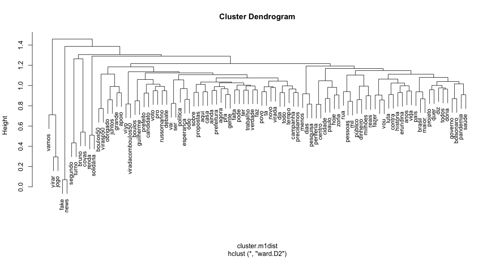
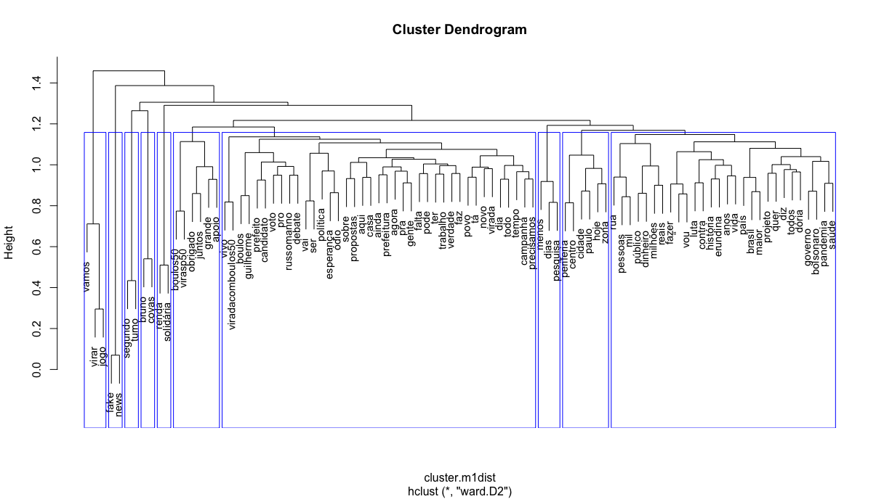
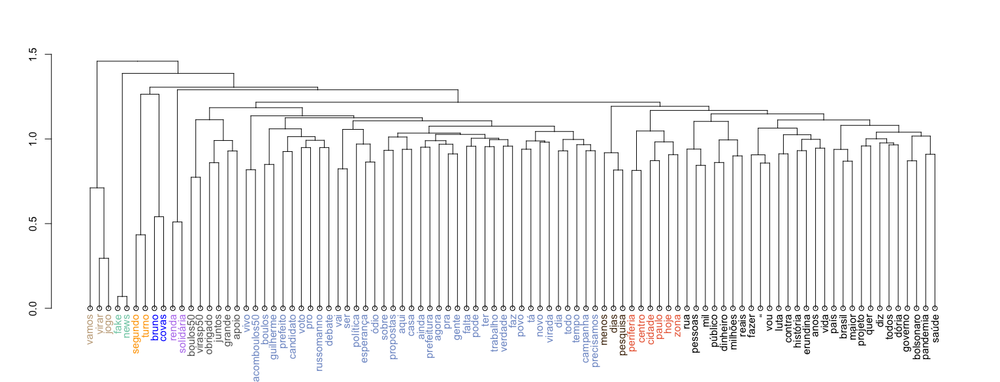

# Using tm package for dendogram and associacions

Rodrigo Esteves de Lima Lopes \
*Campinas State University* \
[rll307@unicamp.br](mailto:rll307@unicamp.br)


# Introduction

Like we have already discussed, the package [tm](http://tm.r-forge.r-project.org/index.html) is a impressive tool for text processing. In this tutorial we are going to use it for calculating word clusters towards a corpus of tweets. 

# What will you need

## Packages

For this tutorial we are going to need the following packages:


```r
library(tm)
## Text processing 
library(stats)
## Statistical analysis
library(rtweet)
## Twitter scraping
```


## Customised functions

In this tutorial we will need a couple of customised functions:


```r
removeURL <- function(x) gsub("http[[:alnum:][:punct:]]*", "", x) 
remove.users <-function(x) gsub("@[[:alnum:][:punct:]]*","",x)
colLab <- function(n) {
  if (is.leaf(n)) {
    a <- attributes(n)
    labCol <- labelColors[clusMember[which(names(clusMember) == a$label)]]
    attr(n, "nodePar") <- c(a$nodePar, lab.col = labCol)
  }
  n
}
```

I will download [Guilherme Boulos'](https://twitter.com/GuilhermeBoulos) [Twitter](https://twitter.com/) timeline:


```r
boulos <- get_timelines("GuilhermeBoulos", n = 3200)
```

# Doing some analysis

First we will extract the text vector represented by Boulos' timeline and, then, creating the corpus


```r
boulos.v <- boulos$text
corpus.cluster <- Corpus(VectorSource(boulos.v))
```

Now we are going to make a series of transformations, using `tm_map`, which applies changes into the corpus and a series of self-explaing functions:


```r
corpus.cluster <- tm_map(corpus.cluster, content_transformer(tolower))
corpus.cluster <- tm_map(corpus.cluster, content_transformer(removeURL))
corpus.cluster <- tm_map(corpus.cluster,content_transformer(remove.users))
corpus.cluster <- tm_map(corpus.cluster, stripWhitespace)
corpus.cluster <- tm_map(corpus.cluster, removePunctuation)
corpus.cluster <- tm_map(corpus.cluster, function(x)removeWords(x,stopwords("pt")))
```

Now we are going to create a dtm for usinf in the calculations


```r
cluster.tdm <- TermDocumentMatrix(corpus.cluster)
```

Now we are going to remove the sparse words and zero word tweets


```r
cluster.m <- as.matrix(cluster.tdm)
cluster.wf <- rowSums(cluster.m)
cluster.m1 <- cluster.m[cluster.wf>quantile(cluster.wf,probs=0.99), ]
#removing 0 columns
cluster.m1<-cluster.m1[,colSums(cluster.m1)!=0]
```

Transforming the relationship in Binary


```r
cluster.m1[cluster.m1 > 1] <- 1
cluster.m1dist <- dist(cluster.m1, method="binary")
```

Finally creating the cluster using Ward's method


```r
clus1 <- hclust(cluster.m1dist, method="ward.D2")
```

Creating the cluster


```r
plot(clus1, cex=0.9)
```



Now, improving it:


```r
rect.hclust(clus1,k=10,border = "blue")
```



Let us make our cluster colourful


```r
dend <- as.dendrogram(clus1)

labelColors <- c("#809acd", "#000000", "#EB6841", "#666666","#80cdb3", 
                "#c5ab8a","#ffa500","#0000ff", "#523415", "#b882ee")
clusMember <- cutree(clus1, 10)


clusDendro <- dendrapply(dend, colLab)

plot(clusDendro,cex=1)
rect.hclust(clusDendro,k=2)
```


The result should be something like this:


Now let us find some associates:


```r
findAssocs(cluster.tdm,"boulos",corlimit = .1)
```


```r
findAssocs(cluster.tdm,"fake",corlimit = .16)
```


